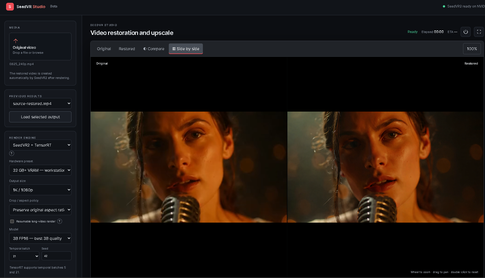

# VRGDG SeedVR2 TensorRT Studio

A local video restoration and upscale studio for SeedVR2 with TensorRT acceleration for faster VAE processing, a custom JavaScript interface, and FastAPI backend.

## Screenshot

## Features

- Original, Restored, Compare, and synchronized Side by side viewing modes.
- One shared play button, timeline scrubbing, frame stepping, fullscreen, zoom, pan, and wipe comparison.
- Preview renders and full-video renders with elapsed time and ETA.
- Output presets for original-size enhancement, 1K/1080p, 2K/1440p, and 4K/2160p.
- Preserve the original aspect ratio or center-crop to 16:9.
- Resumable long-video rendering with automatic frame-aware chunk sizing, manual 30-second to 30-minute choices, retry from the last completed chunk, failure reasons, and saved logs.
- Post-only reprocessing for sharpening, film grain, TensorRT seam smoothing, and optional skin finishing.
- TensorRT decoding uses Optimized Fast automatically and falls back to the internal Stable decoder from saved latents if needed, without rerunning AI restoration.
- Saved settings, previous-output loading, and an Open project folder action.

## Install and start

This package targets Windows with an NVIDIA RTX GPU. Allow at least 35 GB of free disk space for dependencies, model weights, temporary ONNX exports, and locally built TensorRT engines.

1. Double-click **Install SeedVR Studio.bat** once after downloading or cloning the repository.
2. Leave it open while it installs Python/FFmpeg if needed, creates the private environment, installs CUDA PyTorch, SeedVR2, SageAttention 2, and TensorRT RTX, downloads the default model and VAE, and builds engines for your GPU.
3. Double-click **Launch SeedVR Studio Pro.bat**.

The Pro launcher also detects an incomplete installation and opens the installer automatically. Downloads and TensorRT preparation are resumable. Detailed instructions and troubleshooting are in the [installation guide](docs/INSTALLATION.md).

Model weights are stored locally in `models\` and are not committed to GitHub. Outputs, virtual environments, TensorRT engines/caches, and optional runtime files are also kept local.

## Render engines

- **SeedVR2 + TensorRT** — the recommended fast path. It runs SeedVR2 restoration while using TensorRT to accelerate VAE decoding. Fixed TensorRT engines currently support temporal batch sizes **5** and **21**.
- **SeedVR2 (Legacy)** — the standard PyTorch SeedVR2 path. It supports more temporal batch sizes, but it can be substantially slower, especially for long videos.

The batch-size dropdown automatically shows only values supported by the selected engine.

## Workflow

1. Start the Studio and drop an original video into the Media panel.
2. Choose the render engine, output preset, crop policy, model, batch size, and settings.
3. Render a short preview and inspect it in the viewer.
4. Adjust settings as needed, then render the full video.
5. Use **Reprocess post only** to change post-processing without rerunning the AI restoration.

Each job is stored in its own directory under `outputs\`, including output media and logs.

## Settings notes

- Temporal batches follow SeedVR2's `4n+1` rule. Larger batches can improve consistency but use more VRAM.
- Color correction is part of the main SeedVR2 render. `none` leaves colors unchanged; `lab` is the general-purpose matching mode.
- SageAttention 2 is installed and preferred by default. Missing accelerated attention backends fall through to another available option and finally SDPA. See the [SageAttention guide](docs/SAGEATTENTION.md) for verification and repair steps.
- Leave VAE tiling off unless VRAM is insufficient; it saves memory but reduces speed.
- TensorRT uses **Optimized Fast** automatically; every job records the requested and actual decoder in its manifests and log.
- Skin finishing is a non-generative post effect that enhances existing skin pixels; it cannot recreate missing facial identity detail.

## Project layout

- `web/` — JavaScript Studio interface.
- `api_server.py` — FastAPI service.
- `seedvr_studio/` — rendering and legacy Gradio integration.
- `tools/` — TensorRT, assembly, post-processing, and diagnostics.
- `tensorrt_backend/` — optional native TensorRT sources.
- `scripts/` — one-click setup, launcher, model download, verification, and engine preparation scripts.
- `vendor/seedvr2/` — the compatible Apache-2.0 SeedVR2 integration required by the Studio.

## License

The Studio source is released under the MIT License. SeedVR2 and runtime components retain their upstream licenses; see [third-party notices](THIRD_PARTY_NOTICES.md).

## UI guide

The Studio is organized into a settings rail on the left and a video viewer on the right. The screenshots below show the main controls and available settings.

### Main viewer and comparison controls

The viewer provides four display modes:

- **Original** shows only the uploaded source video.
- **Restored** shows the latest rendered result.
- **Compare** overlays the restored video over the original with a draggable wipe divider.
- **Side by side** places the original and restored videos next to each other.

Use the shared timeline to scrub, the frame field or previous/next buttons for frame navigation, and the play button to play both videos together. The wipe control changes the comparison boundary. The zoom button, mouse wheel, drag, and double-click reset control viewer zoom and pan.

### Render engine and output settings

- **Render engine** chooses **SeedVR2 + TensorRT** for the accelerated path or **SeedVR2 (Legacy)** for the standard PyTorch path.
- **Hardware preset** applies a starting configuration for the selected VRAM class. Choose **Custom / manual** to set everything yourself.
- **Output size** chooses **Original / enhancement only**, **1K / 1080p**, **2K / 1440p**, or **4K / 2160p**.
- **Crop / aspect policy** either preserves the source aspect ratio or center-crops to 16:9.
- **Resumable long-video render** saves completed chunks so a failed long render can continue later. **Auto** chooses a chunk size based on duration, frame rate, and temporal batch size.

- **Model** selects the installed SeedVR2 model. FP8 models use less VRAM; FP16 models prioritize quality and require more memory.
- **Temporal batch** controls how many frames are processed together. TensorRT supports **5** and **21**; larger batches may improve temporal consistency but require more VRAM.
- **Seed** makes the restoration repeatable when the other settings and source are unchanged.
- **Color correction** offers `none`, `lab`, `wavelet`, `wavelet_adaptive`, `hsv`, and `adain`. Start with `none` when source colors should be preserved.

### Performance settings

TensorRT uses **Optimized Fast** automatically. If optimized decoding fails, the application retries saved latents with the internal Stable decoder without repeating AI restoration.

- **Attention** offers `sageattn_2`, `sageattn_3`, `flash_attn_3`, `flash_attn_2`, and `sdpa`. Unsupported or unavailable accelerated backends fall back automatically. `sdpa` is the safest compatibility choice.
- **Blocks to swap** trades speed for lower VRAM use. Fewer swapped blocks are faster; more swapped blocks reduce memory use.
- **VAE tiling** reduces memory use for the VAE at a speed cost.

### Post-processing

- **Extra sharpen** adds a post-render sharpening pass.
- **Film grain** adds adjustable grain intensity and saturation.
- **Smooth TensorRT batch seams** applies color and noise matching at temporal batch boundaries.
- **Skin finishing** is an optional non-generative finishing pass with controls for even skin tone, smoothing, redness, shine, blemish cleanup, mark preservation, and face-aware microtexture. Preview before using stronger settings.

### Render workflow

1. Upload a source video.
2. Choose a hardware preset or configure settings manually.
3. Render a short preview using **Preview start** and **Length** to select the source segment.
4. Inspect the result in Original, Restored, Compare, or Side by side mode.
5. Render the full video when the preview looks correct.
6. Use **Reprocess post only** to adjust post-processing without rerunning AI restoration.
7. Use **Load selected output** to reopen a previous result from the output list.

Settings can be saved with **Save current settings**. The project folder contains rendered media, manifests, and logs.
